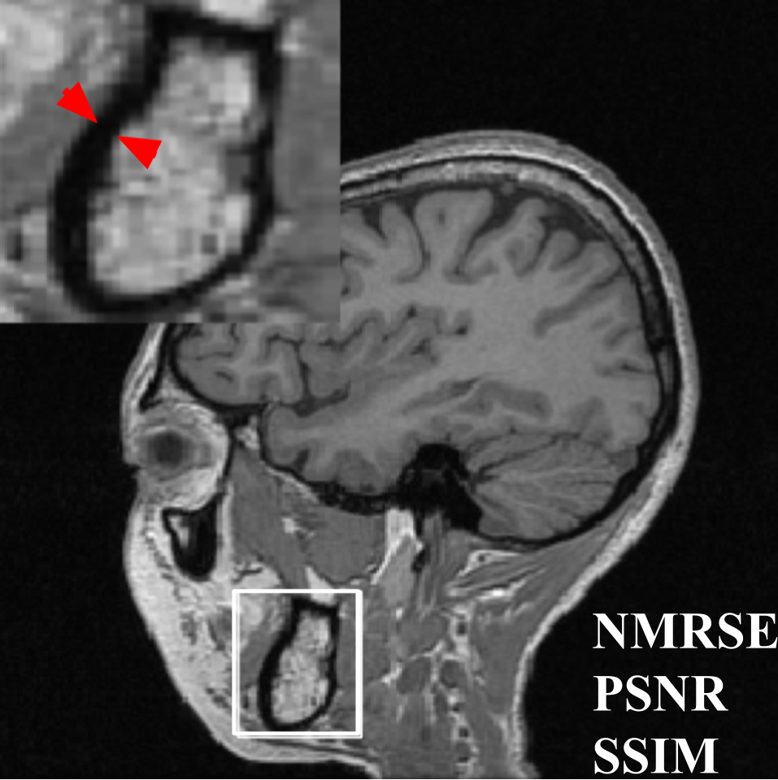
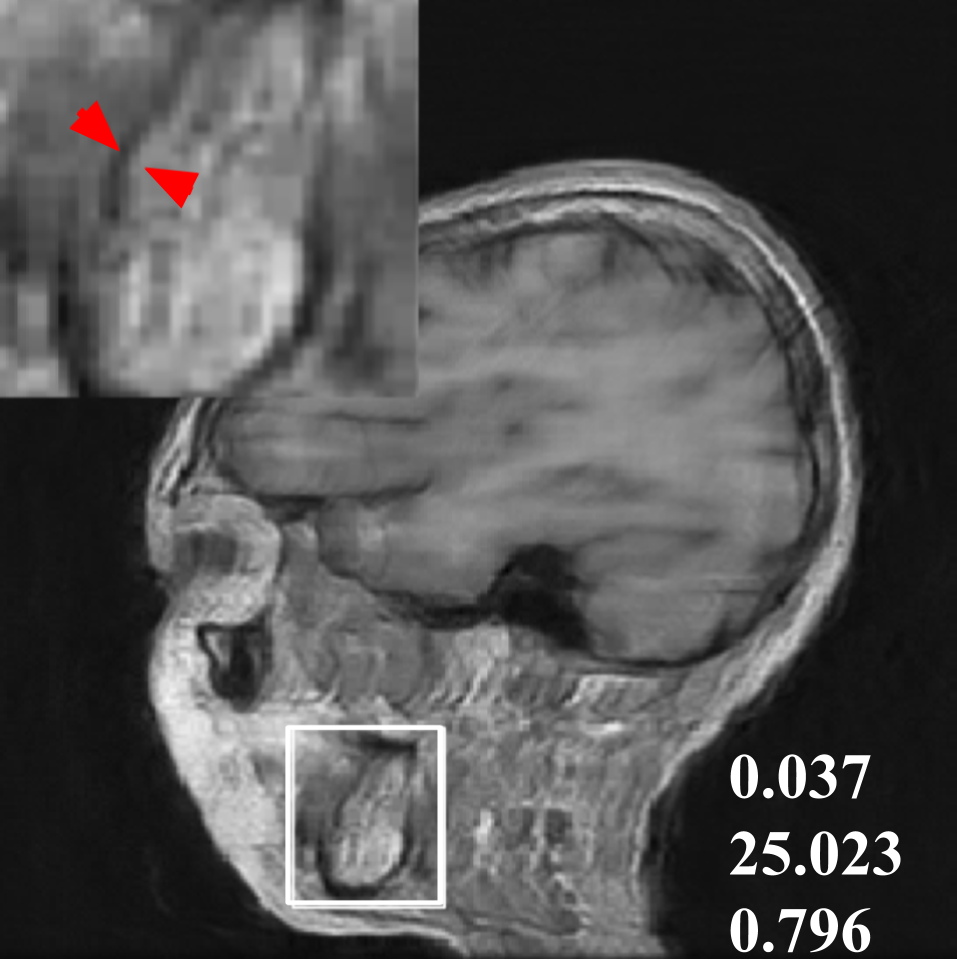
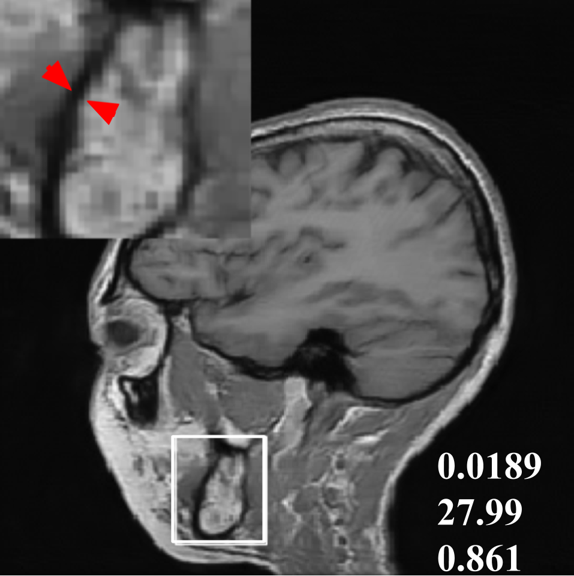

# dualencoder
=======
# Dual-Encoder-Unet
Deep learning has shown great promise for successful acceleration of MRI data acquisition. A variety of architectures
have been proposed to obtain high fidelity image from partially observed kspace or undersampled image. U-Net has
demonstrated impressive performance for providing high quality reconstruction from undersampled image data. The recently proposed dAutomap is an innovative approach to directly learn the domain transformation from source kspace to target image domain. However these networks operate only on a single domain where information from the excluded domain is not utilized for reconstruction. This paper provides a deep learning based strategy by simultaneously optimizing both the raw kspace data and undersampled image data for reconstruction. Our experiments demonstrate that, such a hybrid approach can potentially improve reconstruction, compared to deep learning networks that operate solely on a single domain.

  

