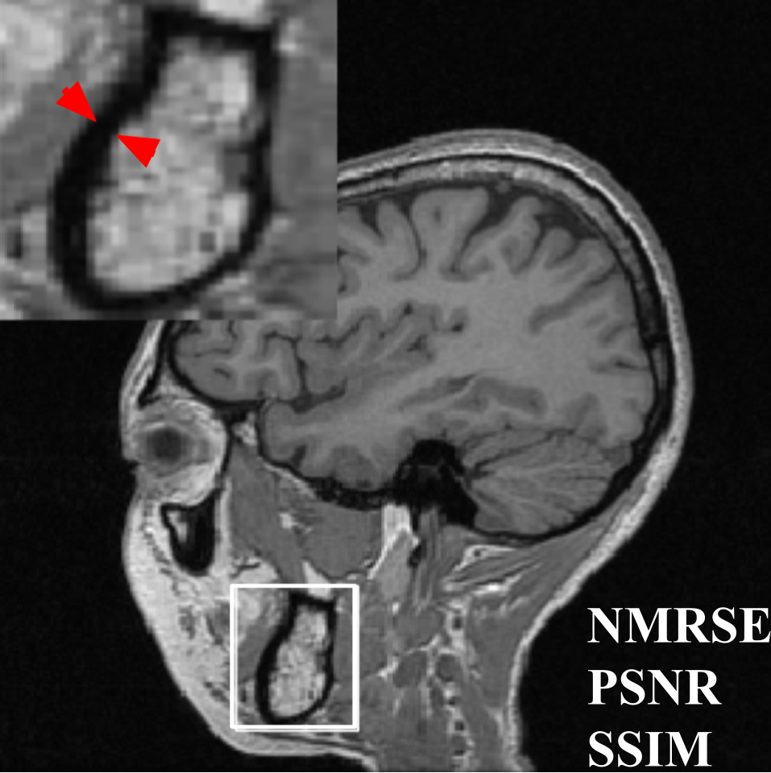
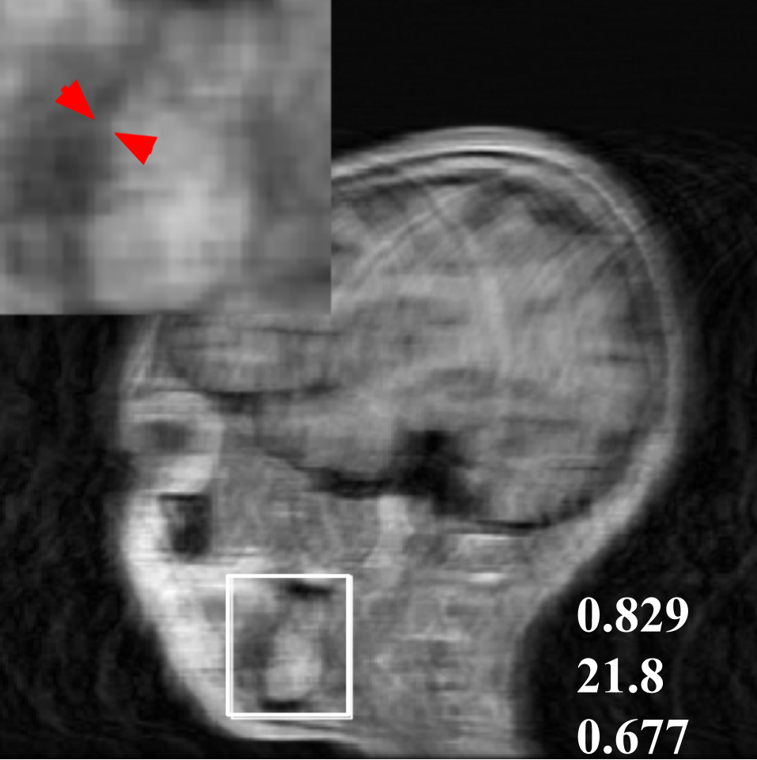
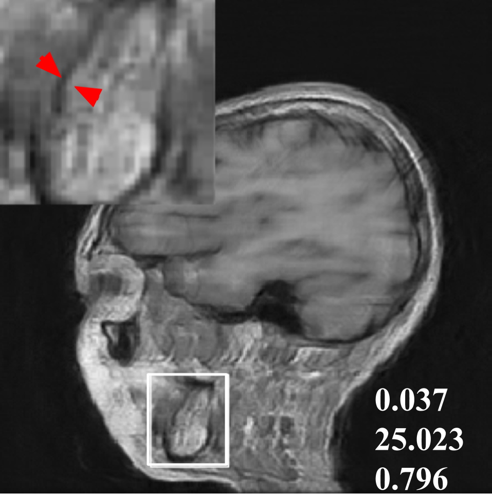
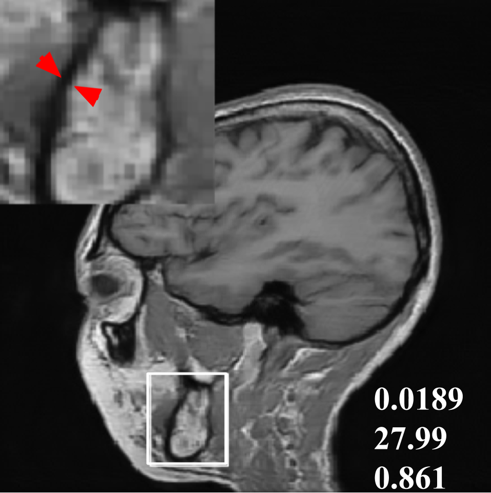

# dualencoder_singlechannel
=======
Deep learning has shown great promise for successful accel-
eration of MRI data acquisition. A variety of architectures
have been proposed to obtain high fidelity image from par-
tially observed kspace or undersampled image. U-Net has
demonstrated impressive performance for providing high
quality reconstruction from undersampled image data. The
recently proposed dAutomap is an innovative approach to di-
rectly learn the domain transformation from source kspace to
target image domain. However these networks operate only
on a single domain where information from the excluded
domain is not utilized for reconstruction. This paper provides
a deep learning based strategy by simultaneously optimiz-
ing both the raw kspace data and undersampled image data
for reconstruction. Our experiments demonstrate that, such
a hybrid approach can potentially improve reconstruction,
compared to deep learning networks that operate solely on a
single domain.

  

>>>>>>> 38c7ac79645e9ed82548c0fcfc77d9500d6ff428
=======
implementing dAutomap,Unet and Dual-Encoder-Unet on Calgary,Cardiac and Knee datasets 
>>>>>>> 5d8892d0c336c71e35c833c01f5a913915588f7f
